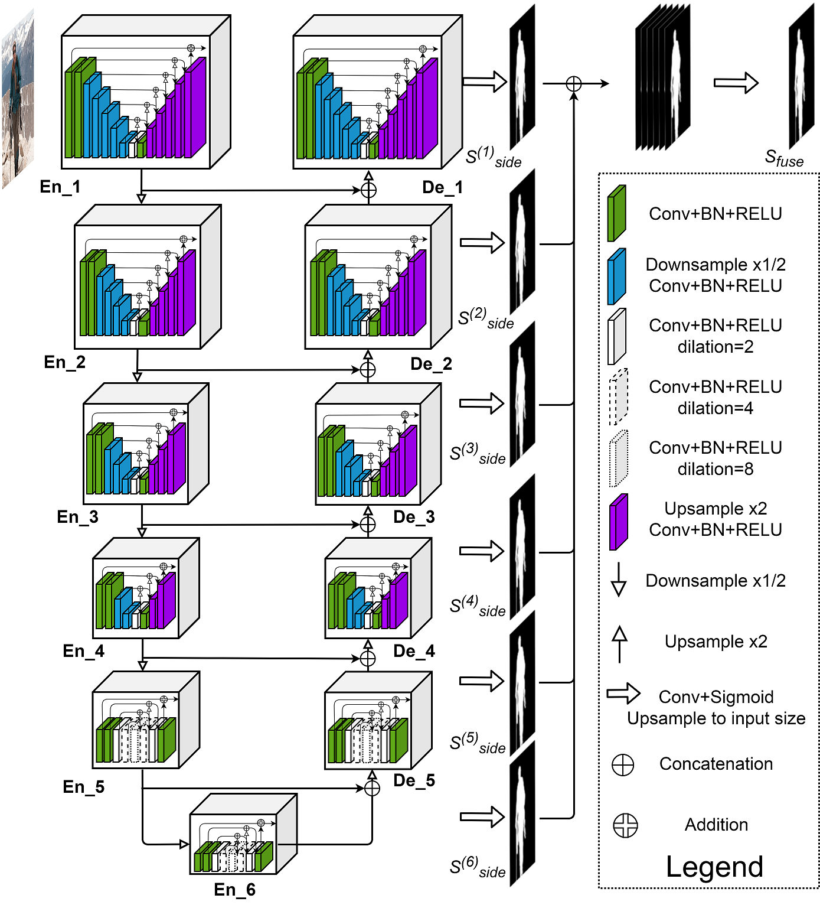

# Background Removal Bot

A Deep Learning-based telegram bot for removing the background from most pictures, available at https://t.me/BackgroundRemovalBot .

The neural network architectures currently being used are [zhixuhao's implementation of the U-Net](https://github.com/zhixuhao/unet) in Keras and [NathanUA's et al. authoral U^2-Net](https://github.com/NathanUA/U-2-Net).

## U-Net

## U^2-Net

